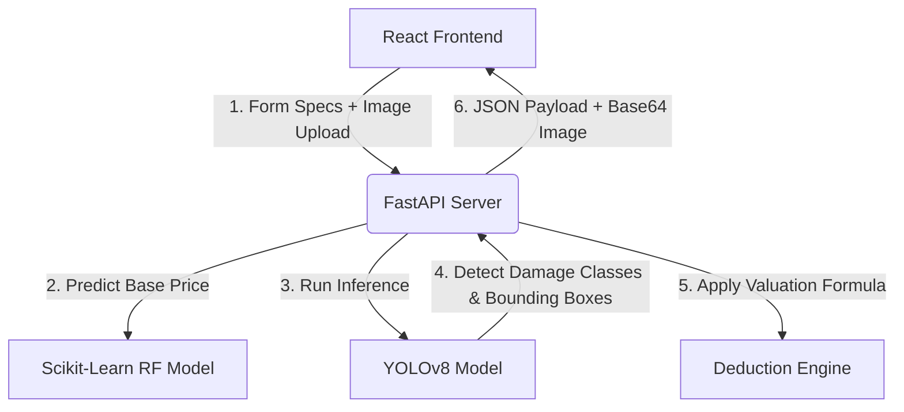

# PriceDekho 🚗
### **AI-Powered Full-Stack Car Valuation & Damage Detection Platform**

PriceDekho is an advanced full-stack web application designed to automate and digitize car appraisal. It combines **Machine Learning** (Scikit-Learn Random Forest Regression) with **Computer Vision** (YOLOv8 Object Detection) to estimate the fair market price of a used vehicle and automatically apply valuation deductions by scanning body damage in real-time.

---

## 🌟 Key Features
- **AI-Powered Damage Scan**: Upload a car image to locate and classify structural/cosmetic damages (`scratch`, `dent`, `broken`).
- **Dynamic Price Appraiser**: Estimate base market value based on key attributes (Kms driven, purchase year, fuel type, transmission, and original showroom price).
- **Automated Damage Deductions**: Dynamic deduction mechanism that calculates body damage severity and discounts the valuation accordingly.
- **Modern Responsive Design**: A high-fidelity, premium glassmorphism user interface designed for both mobile and desktop screens.

---

## 🏗️ Architecture Overview

The system is built on a decoupled full-stack architecture:



### **1. Machine Learning (Base Price)**
- **Algorithm**: Random Forest Regressor (`price_model.pkl`)
- **Features Used**:
  - Purchase Year
  - Original Showroom Price (Lakhs)
  - Kilometers Driven
  - Fuel Type (Petrol / Diesel / CNG)
  - Seller Type (Dealer / Individual)
  - Transmission (Manual / Automatic)
  - Previous Owners (0 / 1 / 2+)

### **2. Computer Vision (Damage Severity)**
- **Model**: YOLOv8 Neural Network (`runs/detect/train3/weights/best.pt`)
- **Target Classes**: `scratch`, `dent`, `broken`
- **Formula**: The damage deduction scales dynamically based on the ratio of bounding box area to total image area, weighted by the damage type:
  $$\text{Damage Score} = \sum \left( \frac{\text{Bounding Box Area}}{\text{Total Image Area}} \times \text{Damage Weight} \right)$$
  $$\text{Final Price} = \text{Base Price} \times \left(1 - (\text{Damage Score} \times 0.5)\right)$$

---

## 📁 Repository Structure

```text
dlmp/
├── api.py                      # FastAPI App (routing, image serialization)
├── main.py                     # Prediction orchestration script
├── visualise.py                # OpenCV bounding box & label annotation utility
├── price_model.pkl             # Trained Scikit-Learn Random Forest Model
├── runs/
│   └── detect/
│       └── train3/
│           └── weights/
│               └── best.pt     # Fine-tuned YOLOv8 damage weights
├── requirements.txt            # Python dependencies (production & local)
└── pricedekho-ui/              # Vite + React Frontend Project
    ├── src/
    │   ├── App.jsx             # Main interactive application UI
    │   ├── App.css             # Glassmorphism styling sheets
    │   └── main.jsx
    ├── package.json
    └── vite.config.js
```

---

## 🚀 Local Setup Guide

### **Backend Setup (Python)**
1. Navigate to the root directory:
   ```bash
   cd dlmp
   ```
2. Create and activate a Python virtual environment:
   ```bash
   python3 -m venv .venv
   source .venv/bin/activate  # On Windows: .venv\Scripts\activate
   ```
3. Install dependencies:
   ```bash
   pip install -r requirements.txt
   ```
4. Spin up the API server:
   ```bash
   python -m uvicorn api:app --host 0.0.0.0 --port 8000 --reload
   ```
   *The backend will now be running at `http://localhost:8000`.*

### **Frontend Setup (Node.js)**
1. Navigate to the frontend directory:
   ```bash
   cd pricedekho-ui
   ```
2. Install npm packages:
   ```bash
   npm install
   ```
3. Run the development server:
   ```bash
   npm run dev
   ```
   *The frontend website will open at `http://localhost:5173`.*

---

## 🌐 Production Deployment Guide

### **1. Backend (FastAPI on Render)**
1. Sign in to [Render](https://render.com) and create a **New Web Service**.
2. Connect your GitHub repository.
3. Configure the following service settings:
   - **Environment**: `Python`
   - **Build Command**: `pip install -r requirements.txt`
   - **Start Command**: `python -m uvicorn api:app --host 0.0.0.0 --port $PORT`
   - **Plan**: Free (The CPU-only PyTorch setup in `requirements.txt` runs seamlessly within free resource limits).
4. Copy the generated Web Service URL (e.g., `https://pricedekho-api.onrender.com`).

### **2. Frontend (React on Vercel)**
1. Sign in to [Vercel](https://vercel.com) and click **Add New Project**.
2. Connect your GitHub repository.
3. Configure project settings:
   - **Framework Preset**: `Vite`
   - **Root Directory**: `pricedekho-ui`
   - **Build Command**: `npm run build`
   - **Output Directory**: `dist`
4. Add the following **Environment Variable**:
   - **Key**: `VITE_API_URL`
   - **Value**: `https://pricedekho-api.onrender.com` *(Paste your live Render backend URL)*
5. Click **Deploy**. Your live web application will build and deploy in less than a minute!
